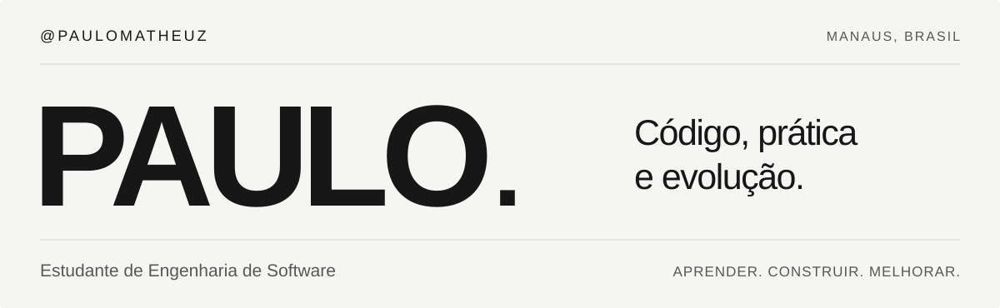

<picture>
  <source media="(max-width: 600px) and (prefers-color-scheme: dark)" srcset="assets/header-mobile-dark.svg">
  <source media="(max-width: 600px)" srcset="assets/header-mobile-light.svg">
  <source media="(prefers-color-scheme: dark)" srcset="assets/header-dark.svg">
  
</picture>

  <a href="#aprendizado">Aprendizado</a> &nbsp; / &nbsp;
  <a href="#contato">Contato</a>

## Olá, eu sou o Paulo.

Sou estudante de **Engenharia de Software**, em Manaus, e estou construindo minha base com **Python e Git**. Meus projetos passam por programas de terminal, consumo de APIs e testes automatizados.

**Busco um estágio ou minha primeira oportunidade em desenvolvimento de software**, para aprender com uma equipe e contribuir com o que venho praticando.

  
  

## Aprendizado

**Estou praticando:** Python, Git e GitHub, APIs HTTP, JSON e testes com pytest.

<b>Outros estudos</b> — fundamentos em C

Também mantenho [exercícios acadêmicos em C](https://github.com/paulomatheuz/desafios-estrutura-dados-c), como parte da minha formação.

## Vamos conversar?

Se você tem uma oportunidade de estágio, uma sugestão para meus projetos ou quer trocar experiências de estudo, pode me encontrar no [LinkedIn](https://www.linkedin.com/in/paulo-martins-78b962297/) ou pelo e-mail **[paulomatheuz.email@gmail.com](mailto:paulomatheuz.email@gmail.com)**.

---

<i>“Prepara-se o cavalo para o dia da batalha, porém do Senhor vem a vitória!”</i>

