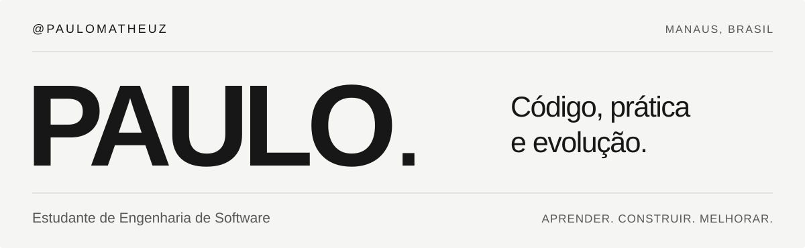

<picture>
  <source media="(max-width: 600px) and (prefers-color-scheme: dark)" srcset="assets/header-mobile-dark.svg">
  <source media="(max-width: 600px)" srcset="assets/header-mobile-light.svg">
  <source media="(prefers-color-scheme: dark)" srcset="assets/header-dark.svg">
  
</picture>

<h3 align="center">Estudante de Engenharia de Software | Consultor Tecnológico na Samsung | Manaus, AM</h3>

 

  Desenvolvo projetos práticos em Android, sistemas embarcados e automação de diagnóstico. Trabalho com Python, Kotlin, Java e C, aplicando testes, tratamento de erros e documentação. Busco um estágio ou minha primeira oportunidade em desenvolvimento de software, para aprender com uma equipe e contribuir com o que venho praticando.

  
  

<i>“Prepara-se o cavalo para o dia da batalha, porém do Senhor vem a vitória!”</i>

